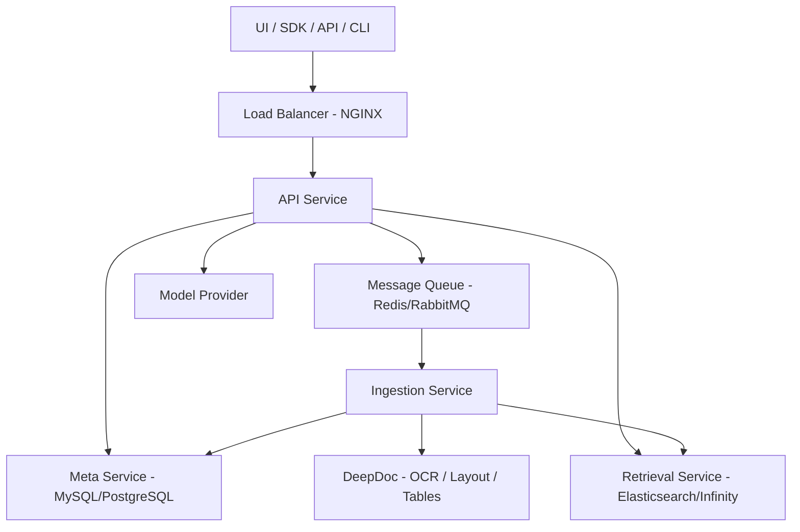

# CS370_HW4
Zuhair Munawar
CS370 Intro to AI
Assignment 3
4/12/2026
---
1. Deep document understanding vs naive chunking (10 pts)
	Deep document understanding and naive chunking are both examples of methods to split and splice documents in a manner such that they can be easily indexed and searchable. Naive chunking would be when you split chucks based on n number of tokens. For example in large documents, you may want to set chunks to be 50 tokens each.  This method isn’t really computationally intensive, and therefore is really time efficient, and simple to implement. 
The trade off of the naive chunking method would be that it isn’t great to determine context or more complex formats. For example if there was a document with multiple paragraphs, let's say 3 paragraphs , and you set chunks on a number of tokens such that it splits the 3 paragraphs into 1.5 paragraphs each. The context of that second paragraph would be split between the first and second chunks.
	Deep Document understands that there are various formats and diverse retrieval requirements. It uses optical character recognition, or OCR since many documents are presented as images , and it allows for universal text extraction. Through OCR , Deep Document understanding also has layout recognition which covers the cases of text,tile, tables, etc. For tables specifically it also has Table Structure Recognition which helps break down tables. 	In terms of index design , naive chunking would be generic indexing because the chunks have an equal number of tokens. With Deep Document because layout recognition and TSR captures additional context such as paragraph,tables, headings, columns, and rows it allows for specific indexing. Because Deep Document understanding
is a more complex process in which it gathers more information it therefore is more computation intensive.
---
2. Chunking strategy: template vs semantichttps://www.pinecone.io/learn/chunking-strategies/ 
Template based chunking is where you split the chunks based on headers, paragraphs, and tables. You can also split it up based on the html heading formats such as the <h> and 
 tags. Semantic chunking splits it up based on the meaning and where it senses the meaning starts to shift. It does this through vector embeddings where it determines changing meanings when it compares semantic differences. Template based fails on loosely structured documents because it can’t really determine the cutoff of a section in a manner which produces consistency. On the other hand, highly structured might fail semantic searching because semantic searching might ignore the structure that was set which may be important or intentional.
---
3.Hybrid retrieval architecture (10 pts)
Lexical Search basically looks for exact matches. I understand that lexical search is similar to ctrl f on a document where to look for identical sequences of characters without regarding its meaning or context. Vector search basically not only looks for exact meanings but also captures meaning. For example, it can embed words like vehicle and car together and be near each other in vector space. So the result of  this is that vector search also can return words with similar meaning. The trade off of lexical search would be the lack of meaning and context, and the downside of vector would be it might not be useful if you're looking for an exact match like a barcode or product number. This is why a hybrid of the two methods would be ideal to handle different cases. Hybrid methods could potentially fail when the different search methods output different results.
---
4. Multi-stage retrieval pipeline (10 pts)
Why is a multi-stage pipeline superior to a single-pass ANN search?  https://medium.com/@adnanmasood/re-ranking-mechanisms-in-retrieval-augmented-generation-pipelines-an-overview-8e24303ee789 
Multi-stage pipeline is superior to single pass ANN search because of how it decomposes retrieval into 3 processes: candidate generation, re-ranking, and query refinement. Candidate generation is better for recall because it is a broad search, re-ranking helps with narrowing down the candidates allows for better precision. Cascading error propagation occurs because when the candidate generation stage fails, which causes the other stages to fail also. It will be difficult for re rank to look for relevant candidates when the candidate generation fails to capture any. 
---
5. Indexing strategy and storage backends (10pts)https://www.paradedb.com/blog/elasticsearch-vs-postgres 
https://medium.com/@tsiciliani/introduction-to-ai-native-vector-databases-c8258773196d 
https://aws.amazon.com/blogs/machine-learning/improving-retrieval-augmented-generation. 
Design Criteria for an Elasticsearch-like hybrid store would be if you're working with mixed text and a lot of metadata. If you’re working with semantics, vector-native DB would be the best option because it allows for high dimensional vector embedding, which is good for recommendation systems. A graph-augmented store is good if your workload features a lot of complex relationships such as fraud detection where you have to detect a non obvious pattern across interconnected transactions. 
---
6. Query understanding and reformulation (10 pts)
Query transformation is critical in RAG because queries are not always 1:1 to what is written in documentation. The query might use a synonym such as “doesn’t work” where in the document it says “fail”. Static query is ideal when the words are 1:1. Query transformation is essential here because it adds related terms to the query that allows for increased true positive rate or recall. It can also conduct a decomposition where it breaks down into sub queries. Iterative query refinement (Agent Driven) as the name suggests loops depending on the results of the query. It does this by retrieving the information, evaluating it, and then retrieves it. If not it just loops. The concern with this approach is that if it is not optimized it can cause an infinite loop and be time consuming. 
---
7. Knowledge representation layer (10 pts)
Dense Vector Space is where the document chunks become a vector, and where similarity is determined by things such as cosine similarity. Relational Schema would be like the explicit formats that are used in SQL databases where each field has its own data type int,char,date, therefore not good for unstructured data. Knowledge graph helps draw more complex relationships that may seem unapparent. Compositional reasoning means answering questions that require combining multiple facts. Vectors handle single-step semantic retrieval well but struggle with multi-hop composition where Knowledge Graphs would do better. Relational schemas handle structured composition but can't handle unstructured text at all. In terms of retrieval explainability, you can use the cosine similarity which may not be that interpretable compared to knowledge graph because a knowledge graph can show the path of the relationship and explain the why. Relational schema retrieval uses SQL commands to pull records based on keys.
---
8. Data ingestion pipeline architecture (10 pts)
Schema normalization basically handles how there are different format types ranging from PDFs to spreadsheets. Sources that are PDFs,word documents, or PPT are converted into a JSON file, spreadsheets are html, and audio is text using text to speech, images are converted to text though OCR. Incremental indexing is supported implicitly through the modular pipeline design: individual documents can be re-processed without re-ingesting the entire knowledge base.
Consistency vs. throughput surfaces in two places. A Chunker's token size setting which default 512 token balances retrieval quality against index size chunks too large to exceed model context limits, too small fragment coherent semantics. The Transformer stage trades ingestion speed for retrieval quality by using an LLM to enrich each chunk with summaries, keywords, or generated questions at index time rather than query time.
---
9. Memory design in RAG systems (10 pts)
Vector memory stores conversation as embedding, where when a new query arrives it retrieves the most relevant results. This is good for general conversation where the past context isn’t fully required. Its however isn’t good with tracking relationships as they change. SQL stores points from a conversation explicitly. The downside is that the schema rigidity doesn’t expect unexpected conversations. Episodic Logs stores the raw conversation history with timestamps. THe downside is that there is a context window limit which means that  summarization and truncation is required therefore information loss. 
---

10. End-to-End System Decomposition

Microservices Architecture

RAGFlow decomposes into eight services across three communication planes: ingestion, query, and meta access.
---

---

Stateless vs. Stateful

Stateless: API Service, Ingestion workers, DeepDoc, Model Provider — pure compute with no data ownership.

Stateful: Meta Service (MySQL/PostgreSQL), Retrieval Service (Elasticsearch/Infinity), Storage Service (MinIO), Message Queue (Redis/RabbitMQ) - own persistent data and must be managed carefully.

---

Scaling Strategy

API Service - horizontal scale behind NGINX; each request is independent
Ingestion Service add workers pulling from RabbitMQ; throughput scales linearly
DeepDoc - GPU-bound; scale by adding GPU nodes and batching inference
Retrieval Service - shard the index across nodes; add read replicas for query-heavy workloads
Meta Service - primary + read replicas; most critical single point of failure, requires HA failover

---

Failure Isolation

The message queue between API and Ingestion is the key isolation boundary, if ingestion goes down, query serving is unaffected; documents queue and process on recovery.

If the Retrieval Service degrades, a circuit breaker prevents slow responses from blocking all queries. If DeepDoc is unavailable, Ingestion falls back to the Naive parser, degrading quality without losing availability.

